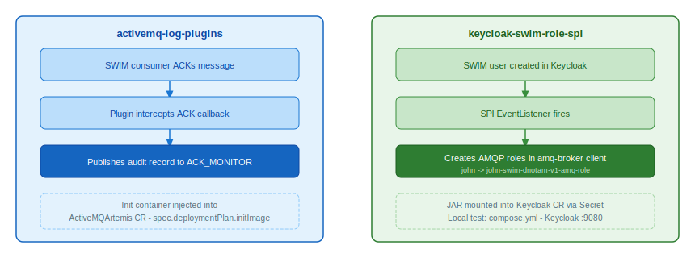

# swim-developer-add-ons

Platform-level extensions for the SWIM infrastructure. Not SWIM services, broker and identity add-ons that the SWIM services depend on to run correctly on OpenShift.

## Modules

| Module | What it does |
|--------|-------------|
| [activemq-log-plugins](activemq-log-plugins/) | Artemis broker plugin: intercepts message ACKs and publishes delivery audit records to `ACK_MONITOR` |
| [keycloak-swim-role-spi](keycloak-swim-role-spi/) | Keycloak EventListener SPI: auto-creates per-user Artemis client roles on user registration |

See each module's `README.md` for build, install, and verification instructions.

---

## License

Licensed under the [Apache License 2.0](LICENSE).
